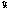

# Morphological Operations: Technical Guide

## Introduction

Morphological operations are crucial in image processing for shape manipulation. This guide covers four key operations: erosion, dilation, opening, and closing.

## Morphological Operators

### Erosion

- **Purpose:** Shrink object boundaries in binary images.
- **Operation:** Move a structuring element; set pixel to 1 if the structuring element entirely fits within the object.

### Dilation

- **Purpose:** Expand object boundaries in binary images.
- **Operation:** Move a structuring element; set the central pixel to 1 if at least one pixel underneath is 1.

### Opening

- **Purpose:** Remove small objects and smooth object boundaries.
- **Operation:** Combine erosion followed by dilation.

### Closing

- **Purpose:** Close small holes or gaps in object boundaries.
- **Operation:** Combine dilation followed by erosion.

## Usage with `morphologic_operators.py`

The script `morphologic_operators.py` provides a `apply` function for morphological operations. It takes a 2D NumPy array and a tuple with the structuring element matrix and spatial point.

**Example:**

```python
import numpy as np
from morphologic_operators import apply, dilation

# Create binary image and structuring element
binary_image = np.array([[0, 0, 0, 0, 0],
                         [0, 255, 255, 255, 0],
                         [0, 255, 255, 255, 0],
                         [0, 255, 255, 255, 0],
                         [0, 0, 0, 0, 0]])

structure_element = (np.array([[1, 1, 1],
                               [1, 1, 1],
                               [1, 1, 1]]), (1, 1))

# Apply dilation using the script
result = apply(binary_image, structure_element, dilation)

```

   
